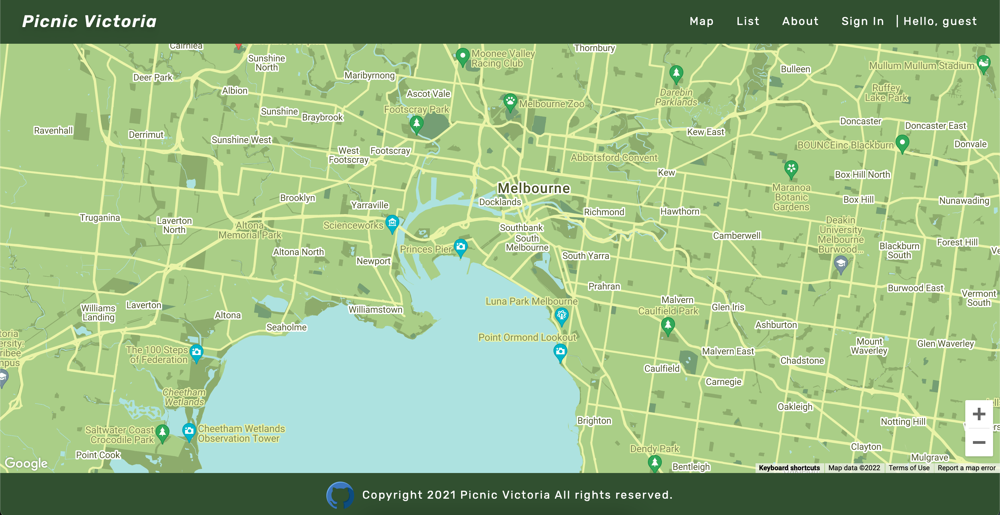
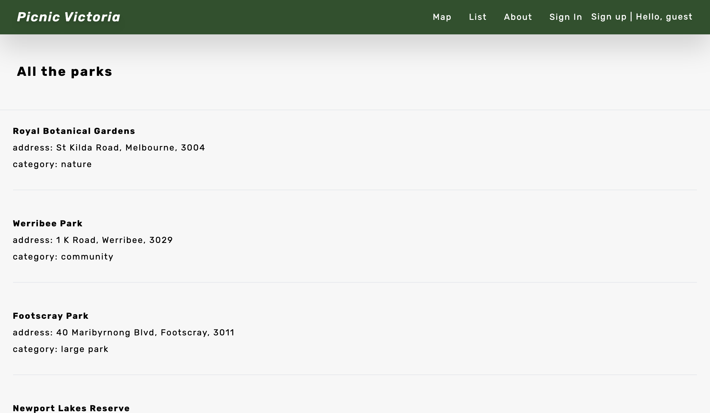
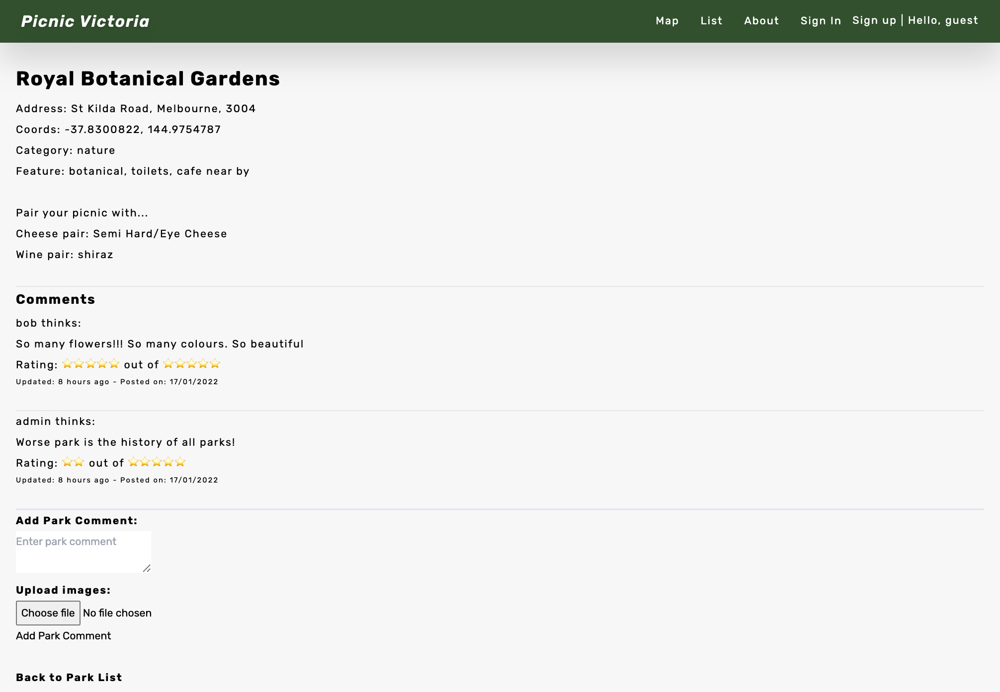
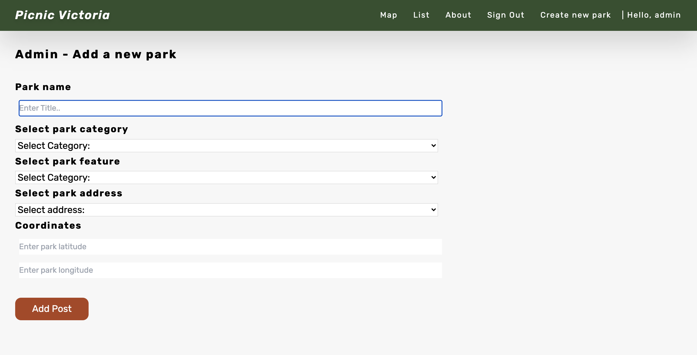
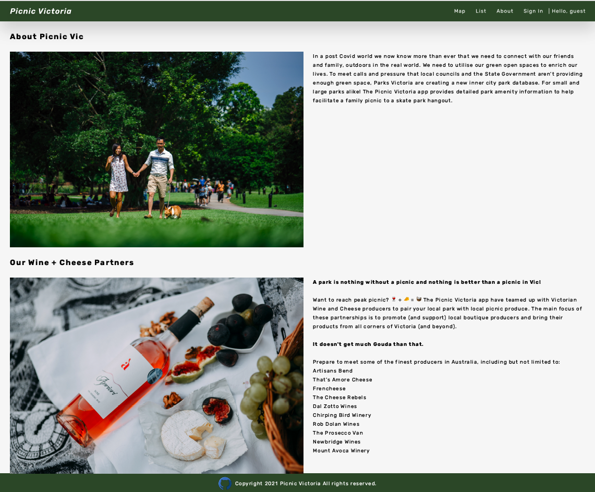

# **Picnic Victoria**

> _Nothing is better than a picnic in Vic!_

[Deployed Picnic Victoria App](https://picnic-vic.netlify.app/) | [PicnicVic Repo](https://github.com/PicnicVic) | [PicnicVic Repo](https://github.com/PicnicVic/parks_react) | [Parks Rails_API Repo](https://github.com/PicnicVic/Rails_API)

**ASSESSMENT:** Full Stack Application - Part B - for Coder Academy

[Past Assignment T3A2-A - Full Stack App (Part A) - documentation](https://github.com/PicnicVic/Main_T3A2-A)

[T3A2-B - Full Stack App (Part B) Deliverable - README.MD documentation](https://github.com/PicnicVic/.github)

**DEV TEAM:** Karla Tolentino, Ruilai Zhang, Matthew Liu, Bella Leber-Smeaton

**For:** Parks Victoria - Victorian State Government

**About:** Picnic Victoria is a React / Rails full-stack responsive web application, coupled with our Picnic Victoria inner city park registry API, ['Parks_API'](https://github.com/PicnicVic/Rails_API).
The 'Parks_API' populated with new park data is paired and marked up with the existing Google Maps API.

**Purpose:** In a world too familiar with the pandemic we now know more than ever that we need to connect with our friends and family, safely and in the real world outdoors.
_We need to utilise our green open spaces to enrich our lives._

To meet calls and pressure that local councils and the State Government aren't providing enough green space, Parks Victoria created Picnic Victoria, For small and large parks alike!

The Picnic Victoria app provides detailed park amenity information to help facilitate a family picnic to a skate park hangout.

**Map View - Landing Page:** GET "/parks"

**List View:** GET "/parks"

**Park id 1 View:** GET "/parks/1"

**Admin create park View:** POST "/parks/new"

**About View:** "/about"

**User SignIn:** POST "/auth/signin"

**User SignUp View** POST "/auth/signin"

#### **Dependencies:**

- "@googlemaps/react-wrapper": "^1.1.19",
- "@react-google-maps/api": "^2.7.0",
- "@testing-library/jest-dom": "^5.16.1",
- "@testing-library/react": "^9.3.2",
- "@testing-library/user-event": "^7.1.2",
- "axios": "^0.24.0",
- "moment": "^2.29.1",
- "react": "^17.0.2",
- "react-dom": "^17.0.2",
- "react-moment": "^1.1.1",
- "react-router": "^6.1.1",
- "react-router-dom": "^6.1.1",
- "react-scripts": "^5.0.0",
- "styled-components": "^5.3.3",
- "autoprefixer": "^10.4.0",
- "postcss": "^8.4.5",
- "postcss-cli": "^9.1.0",
- "tailwindcss": "^3.0.2"
