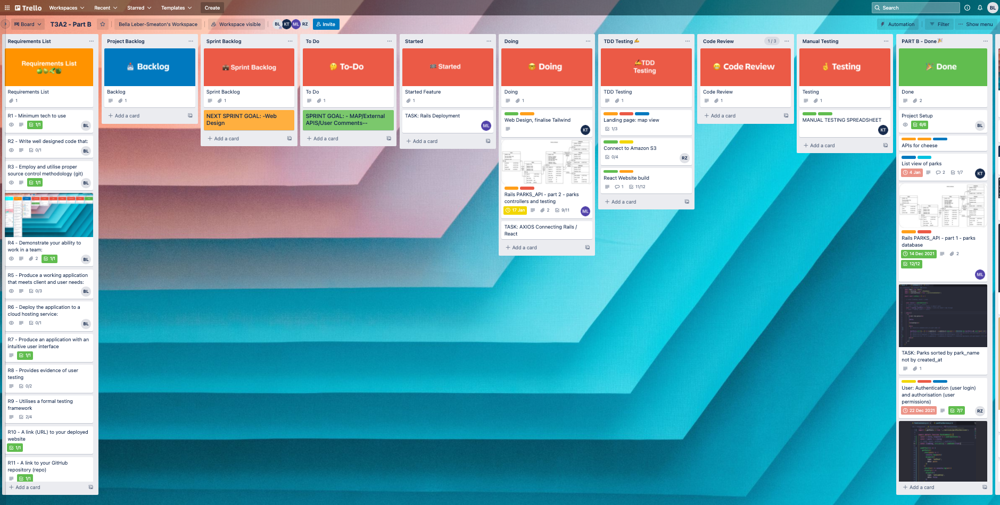
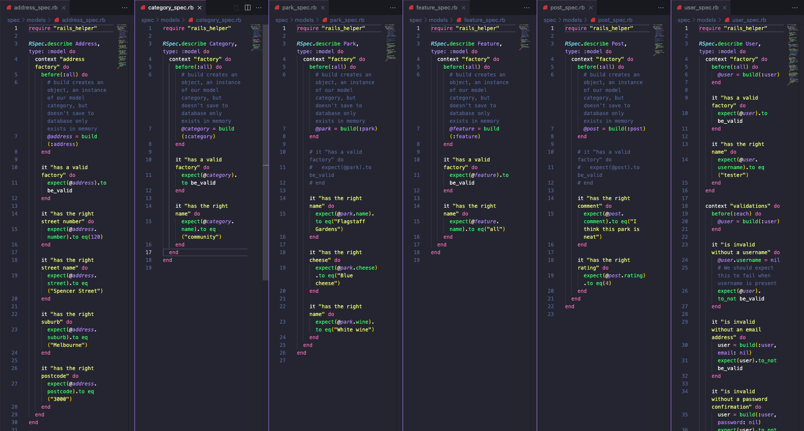
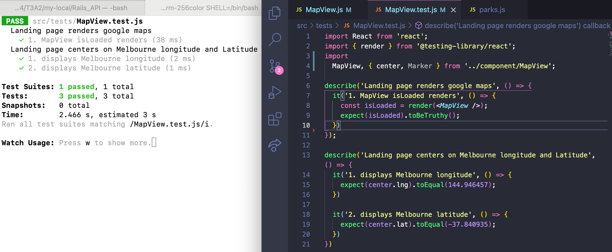
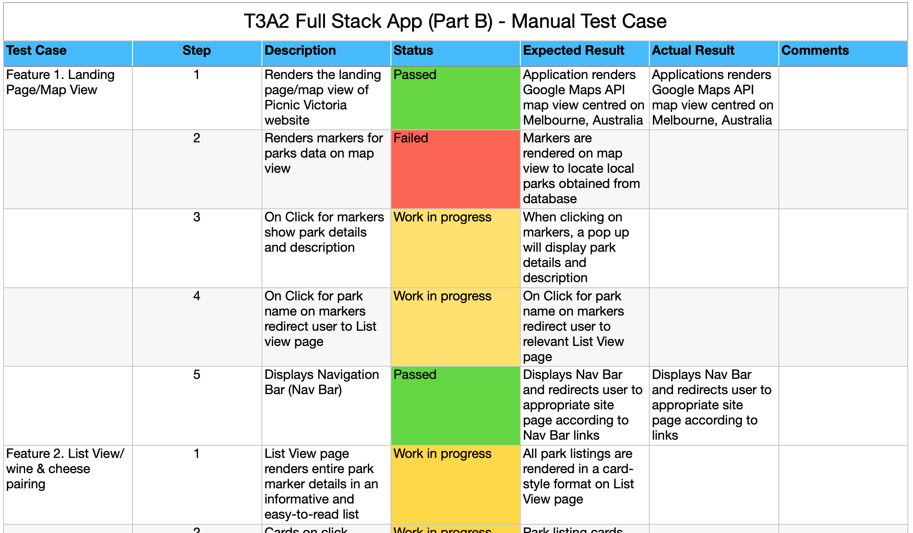

# **Picnic Victoria**

> _Nothing is better than a picnic in Vic!_

[Deployed Picnic Victoria App](https://picnic-vic.netlify.app/) | [PicnicVic React Repo](https://github.com/PicnicVic) | [Parks Rails_API Repo](https://github.com/PicnicVic/Rails_API)

**ASSESSMENT:** Full Stack Application - Part B - for Coder Academy 

**DEV TEAM:** Karla Tolentino, Ruilai Zhang, Matthew Liu, Bella Leber-Smeaton

**For:** Parks Victoria - Victorian State Government

(Map View - Landing Page)

(List View)

(Park View)

(Admin View)

(About View)

(SignIn View)

#### **Dependencies:**

- "@googlemaps/react-wrapper": "^1.1.19",
- "@react-google-maps/api": "^2.7.0",
- "@testing-library/jest-dom": "^5.16.1",
- "@testing-library/react": "^9.3.2",
- "@testing-library/user-event": "^7.1.2",
- "axios": "^0.24.0",
- "moment": "^2.29.1",
- "react": "^17.0.2",
- "react-dom": "^17.0.2",
- "react-moment": "^1.1.1",
- "react-router": "^6.1.1",
- "react-router-dom": "^6.1.1",
- "react-scripts": "^5.0.0",
- "styled-components": "^5.3.3",
- "autoprefixer": "^10.4.0",
- "postcss": "^8.4.5",
- "postcss-cli": "^9.1.0",
- "tailwindcss": "^3.0.2"

#### **Team Work & Source Control Methodology:**

Scrumban methodology

Mini Golf at City Library for EOY Christmas celebrations after a day of studying at city library.

#### **User Testing:**

(Pete from Parks Victoria uploading a park via the Admin signin, success full Creation.)

(Test Park error warning)

#### **Testing Backend:**

#### **Testing Frontend:**

(Testing the Landing Page Map View)

(Testing the Admin View)

(Testing the SignIn View)

#### **Manual Testing:**

[Manual Testing Spreadsheet](https://github.com/PicnicVic/parks_react/blob/dev/docs/manual_testing_spreadsheet.numbers)

(Example of Manual Testing Sheet located in [/docs](./docs/manual_testing_spreadsheet.numbers) folder.)
